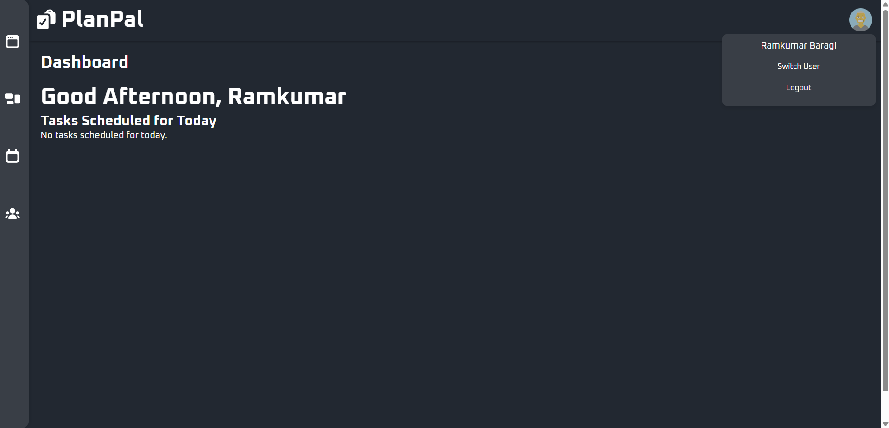

# TaskManagement

A web-based Task Management application designed to help users organize, track, and manage their daily tasks efficiently.

## ✨ Features

- Create, view, update, and delete tasks.
- User-friendly interface.
- Real-time task status updates.
- Responsive design for desktop and mobile.

## 🛠️ Built With

- **Frontend:** HTML, CSS, JavaScript
- **Backend:** Express
- **Database:** Mongoose


## 📁 Project Structure

```
TaskManagement/
├── backend
├── task-scheduler(frontend)
```

## 🚀 Getting Started

### Installation and Running the project

1. Clone the repository:

   ```bash
   git clone https://github.com/ramkumar1887/TaskManagement.git
   ```

2. Navigate to the project folder:

   ```bash
   cd TaskManagement
   ```

3. (Optional) Run both the backend and frontend locally:

   **Start the backend (Express server):**

   ```bash
   cd backend
   node server.js
   ```

   **Start the frontend:**

   ```bash
   cd ../task-scheduler(frontend)
   npm start
   ```


   > **Note:** Make sure the backend is running before using the frontend for full functionality.


## 📷 Screenshots



## 🙌 Contributing

Contributions, issues, and feature requests are welcome!
Feel free to fork the repository and create a pull request.

## 🧑‍💻 Authors

- [Ramkumar Babu Baragi](https://github.com/ramkumar1887)
- [Srishanth-p](https://github.com/Srishanth-p)
